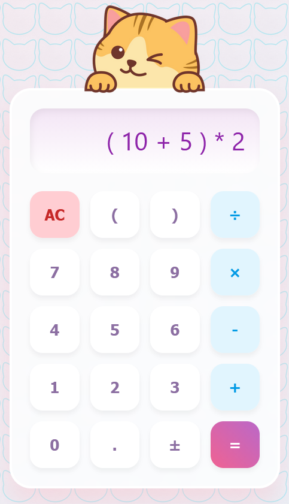

# Soft Precision 🎀

A sophisticated front-end calculator designed with a Soft UI aesthetic and a robust mathematical logic engine.

✨ [Launch Application](https://megdotdev.github.io/soft-precision/)

<div align="center">
  
</div>

## 📖 Overview

Soft Precision bridges the gap between basic and scientific calculators. While the interface utilizes a curated, aesthetic-driven design for visual comfort, the underlying architecture features a custom expression parser capable of evaluating nested operations and proper algebraic precedence.

## 🚀 Key Features

* **Parenthetical Logic:** Full support for nested `( )` grouping to define custom calculation priority.
* **Algebraic Precedence:** Engineered to strictly follow **PEMDAS/BODMAS** order of operations.
* **Full Keyboard Support:** Integrated physical keyboard mapping for numbers, operators, and command keys (Enter, Backspace, Escape).
* **Soft UI Aesthetic:** Responsive interface featuring a pastel color palette and smooth micro-interactions.
* **Input Sanitization:** Real-time validation to prevent mathematically invalid sequences or syntax errors.
* **Cross-Platform Responsive Design:** **Mobile-first architecture** optimized for both touch-targets on phones and pointer-precision on desktops.

## 📟 Keyboard Mapping

| Physical Key | Function |
| :--- | :--- |
| `0 - 9` | Numeric Input |
| `+ - * /` | Operators |
| `(` and `)` | Nested Grouping |
| `=` or `Enter` | Calculate Result |
| `Backspace` | Delete Last Character |
| `Escape` | Clear All |

## 🛠️ Tech Stack

* **Language:** JavaScript (ES6+)
* **Logic:** Regex-based tokenization and the Shunting-yard algorithm
* **Structure:** Semantic HTML5
* **Styling:** CSS3 (Custom Variables, Flexbox, Micro-interactions)

## 🧠 Technical Deep Dive

### The Tokenizer
To process complex strings like `(-5 + 10.5) * 2`, I implemented a custom **Regex-based tokenizer**. This allows the application to distinguish between operators and negative/decimal values before they are passed to the logic engine.

```javascript
// A sample of the Regex used for pattern matching tokens
return str.match(/-?\d+\.?\d*|[+\-*/()]/g);
